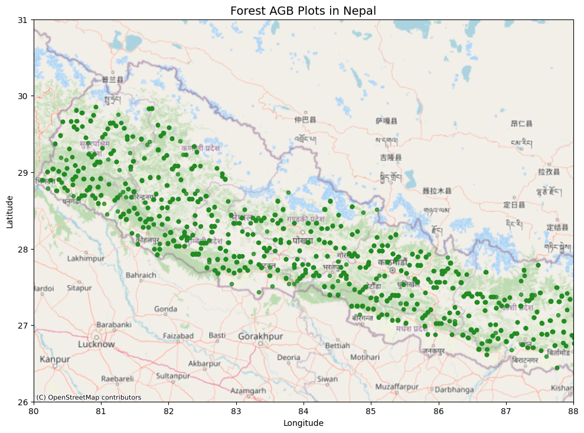

# Nepal Forest AGB Modeling

## Overview
This project aims to estimate **Above Ground Biomass (AGB)** in Nepal's forests by combining field inventory data with satellite imagery. It utilizes a machine learning approach to model forest carbon based on geospatial and ground-truth data.

## Dataset
The project relies on plot-level estimates from Nepal's national forest inventory (2010-2014).
*   **Source**: [Figshare - Nepal Forest AGB & SOC Data](https://figshare.com/articles/dataset/Plot-level_estimates_of_aboveground_biomass_and_soil_organic_carbon_stocks_from_Nepal_s_forest_inventory/21959636)
*   **Key Variables**:
    *   `AGB_tha`: Above Ground Biomass (tonnes/hectare)
    *   `SOC_tha`: Soil Organic Carbon (tonnes/hectare)
    *   `lat`, `lon`: Georeferenced coordinates
    *   `plot_id`: Unique identifier for inventory plots

The map below visualizes the spatial distribution of the sampled forest plots across Nepal, illustrating the coverage of AGB measurements used in this study.



## Repository Structure

The project is organized into clear workflows for handling field data and satellite imagery separately before integration.

### 📂 `notebooks/`
The core logic is split into two sub-directories:

#### 1. Field Data Processing (`notebooks/Field-Data/`)
Follow these notebooks in order to process the ground truth data:
*   **`1-data-understanding.ipynb`**: Initial exploration of the raw CSV dataset.
*   **`2-data-preprocessing.ipynb`**: Cleaning missing values and handling outliers.
*   **`3-data-visualization.ipynb`**: Visualizing spatial distributions and feature correlations.
*   **`4-data-preparation.ipynb`**: Final preparation of field data for merging with satellite features.

#### 2. Satellite Data Acquisition (`notebooks/Satellite-Data/`)
Tools for remote sensing data:
*   **`1-geojson-extraction.ipynb`**: Extracts Areas of Interest (AOI) from spatial files.
*   **`2-satellite-image-fetch.ipynb`**: Fetches Sentinel/Landsat imagery for the defined plots using Google Earth Engine.

### 📄 Key Files
*   **`main.ipynb`**: The primary playground notebook for loading processed data, testing correlations, and running initial models.
*   **`requirements.txt`**: List of Python dependencies.
*   **`about-dataset.md`**: Detailed background information on the dataset and its usage policies.

## Setup & Installation

1.  **Clone the repository**:
    ```bash
    git clone <repo-url>
    cd Nepal-Forest-AGB-Modeling
    ```

2.  **Install Dependencies**:
    Ensure you have Python installed, then run:
    ```bash
    pip install -r requirements.txt
    ```
    *Core libraries include: `pandas`, `geopandas`, `scikit-learn`, `earthengine-api`, `folium`, `seaborn`.*

3.  **Earth Engine Authentication**:
    To use the satellite data fetching notebooks, you must authenticate with Google Earth Engine:
    ```bash
    earthengine authenticate
    ```

## Usage Workflow
1.  **Prepare Field Data**: Run the notebooks in `notebooks/Field-Data/` to clean and understand your ground truth.
2.  **Fetch Imagery**: Use `notebooks/Satellite-Data/` to download corresponding satellite bands for your plot locations.
3.  **Analysis**: Use `main.ipynb` to merge these datasets and train your AGB prediction models.