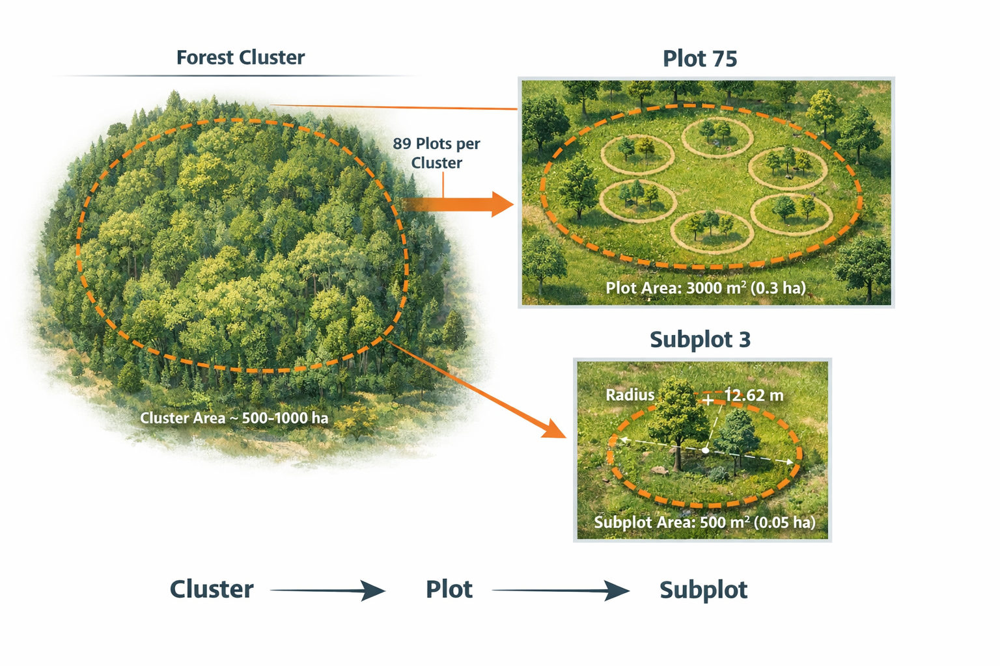

# Code Documentation: 1-data-understanding.ipynb

## Overview

This notebook provides the initial exploration and understanding of the raw field inventory data from Nepal's National Forest Inventory (2010-2014). It focuses on understanding the dataset structure, hierarchical plot organization, and key variables before any data processing occurs.

**Location:** `notebooks/Field-Data/1-data-understanding.ipynb`

---

## Purpose

- Load and inspect the raw field inventory dataset
- Understand the hierarchical structure of plot identifiers (cluster-plot-subplot)
- Document dataset characteristics and variable descriptions
- Familiarize with data format and coordinate systems

---

## Dependencies

### Libraries Used

```python
import pandas as pd
```

**pandas** - For data loading, manipulation, and basic exploratory data analysis

---

## Input Data

### File Path
```python
FIELD_DATA_PATH = "../../data/field-data/nepal_forest_agb.csv"
```

### Dataset Characteristics
- **Rows:** 2,038 (initial count)
- **Columns:** 5
- **Format:** CSV (Comma-Separated Values)

### Input Variables

| Variable | Type | Description |
|----------|------|-------------|
| `plot_id` | string | Composite hierarchical identifier (cluster-plot-subplot) |
| `lon` | float | Longitude in decimal degrees (WGS84) |
| `lat` | float | Latitude in decimal degrees (WGS84) |
| `AGB_tha` | float | Aboveground Biomass in tonnes per hectare |
| `SOC_tha` | float | Soil Organic Carbon in tonnes per hectare (0-30 cm depth) |

---

## Code Structure

### Cell 0-2: Setup
**Markdown:** "Importing Necessary Dependencies" and "Loading Our Data"

Basic setup cells that import required libraries and define the data file path.

### Cell 3: Load Data
```python
FIELD_DATA_PATH = "../../data/field-data/nepal_forest_agb.csv"
```

Defines the relative path to the raw field data CSV file.

### Cell 4: Data Loading and Initial Inspection
```python
df = pd.read_csv(FIELD_DATA_PATH)
print(f"rows = {df.shape[0]}\ncolumns = {df.shape[1]}")
df.head()
```

**Operations:**
1. Loads the CSV file into a pandas DataFrame
2. Prints the shape (rows × columns) of the dataset
3. Displays the first 5 rows using `head()`

**Output:**
- Initial dataset shape: 2,038 rows × 5 columns
- First few rows of the dataset for visual inspection

### Cell 5-6: Data Understanding Section
**Markdown:** "### Data Understanding" and "> Dataset Description"

Documentation cell explaining the dataset source and context.

### Cell 7: Dataset Description
**Markdown content** describing:
- Dataset origin (Scientific Data journal supplement)
- Collection period (2010-2014)
- Number of plots (2,009 AGB plots, 1,156 SOC plots)
- What is included in AGB measurements (all trees, standing dead, stumps)
- Soil carbon depth (0-30 cm)
- Exclusion of organic litter (<1% contribution)

### Cell 8-9: Feature Summary
**Markdown:** "> Feature Summary"

Table documenting each variable in the dataset:

| Feature | Description | Purpose/Use |
|---------|-------------|-------------|
| `plot_id` | Unique identifier for each forest inventory plot | Reference, join, and track plots |
| `lon` | Longitude (decimal degrees, WGS84) | Spatial mapping, GIS analysis |
| `lat` | Latitude (decimal degrees, WGS84) | Spatial mapping, GIS analysis |
| `AGB_tha` | Aboveground Biomass (tonnes/ha) | Quantify forest carbon storage |
| `SOC_tha` | Soil Organic Carbon (tonnes/ha) | Estimate belowground carbon storage |

### Cell 10: Important Notes
**Markdown:** Important observations about the data structure:
- Each row represents a **subplot**, not an entire plot or cluster
- AGB and SOC values are **already scaled to per hectare**
- Subplot area used primarily for scaling and buffering satellite data
- Cluster area typically unknown unless forest boundary shapefile available

### Cell 11-12: Understanding Hierarchical Structure
**Markdown:** "> Understanding Clusters, Plots and Sub-plots"

Explains that `plot_id` is a composite hierarchical identifier used in Nepal's National Forest Inventory.

### Cell 13: Decompose Plot ID Structure
```python
# Sample one plot_id
plot_id_samp = df["plot_id"].sample(n=1).values[0]

# Split the composite ID
cluster_id, cluster_plot_id, cluster_plot_subplot_id = plot_id_samp.split("-")

# Print in required format
print(f"cluster_id: {cluster_id}")
print(f"cluster_plot_id: {cluster_plot_id}")
print(f"cluster_plot_subplot_id: {cluster_plot_subplot_id}")
```

**Operations:**
1. Randomly samples one `plot_id` from the dataset
2. Splits the composite ID using the `-` delimiter
3. Extracts three components: cluster ID, plot ID within cluster, and subplot ID within plot
4. Prints each component separately

**Example Output:**
```
cluster_id: 184
cluster_plot_id: 35
cluster_plot_subplot_id: 2
```

**Purpose:** Demonstrates the hierarchical structure where a plot ID like `"184-35-2"` represents:
- **Cluster 184**
  - **Plot 35** (within cluster 184)
    - **Subplot 2** (within plot 35)

### Cell 14: Visualization Reference
**Markdown/Image:** Reference to a visualization showing the plot hierarchy structure.

```html

```

---

## Key Insights

### Data Structure Understanding
1. **Hierarchical Organization:** The dataset uses a three-level hierarchy (cluster → plot → subplot)
2. **Subplot-Level Data:** Each row represents measurements from a single subplot
3. **Scaled Values:** AGB and SOC values are pre-normalized to per hectare, simplifying later calculations

### Important Considerations
- The hierarchical structure requires careful handling during aggregation
- Subplots within the same plot should be grouped for plot-level analysis
- Geographic coordinates (lon, lat) enable spatial analysis and satellite data matching

---

## Output/Results

This notebook is **exploratory** and does not generate output files. It provides:
1. Visual confirmation of data loading
2. Understanding of dataset structure
3. Documentation of variable meanings
4. Demonstration of hierarchical ID structure

---

## Usage Notes

### When to Run
- **First step** in the Field Data processing pipeline
- Run before any data preprocessing or analysis
- Use when you need to understand the raw data structure

### Prerequisites
- Raw field data file must exist at `data/field-data/nepal_forest_agb.csv`
- pandas library installed

### Next Steps
After running this notebook, proceed to:
- **2-data-preprocessing.ipynb** - Clean and structure the data
- **3-data-visualization.ipynb** - Visualize data distributions (can run in parallel)

---

## Technical Details

### Coordinate Reference System
- **CRS:** WGS84 (EPSG:4326)
- **Format:** Decimal degrees
- **Precision:** Standard GPS precision

### Data Types
- `plot_id`: String (object in pandas)
- `lon`, `lat`: Float64
- `AGB_tha`, `SOC_tha`: Float64

### Missing Values
Initial inspection does not handle missing values (handled in preprocessing notebook).

---

## Related Notebooks

- **2-data-preprocessing.ipynb** - Uses understanding from this notebook to clean data
- **3-data-visualization.ipynb** - Visualizes the data structure understood here
- **4-data-preparation.ipynb** - Uses hierarchical understanding to aggregate data

---

## Error Handling

This notebook assumes:
- The CSV file exists and is readable
- The file has the expected column structure
- No encoding issues with the CSV file

If errors occur, verify:
1. File path is correct relative to notebook location
2. CSV file is not corrupted
3. Required columns exist in the file
